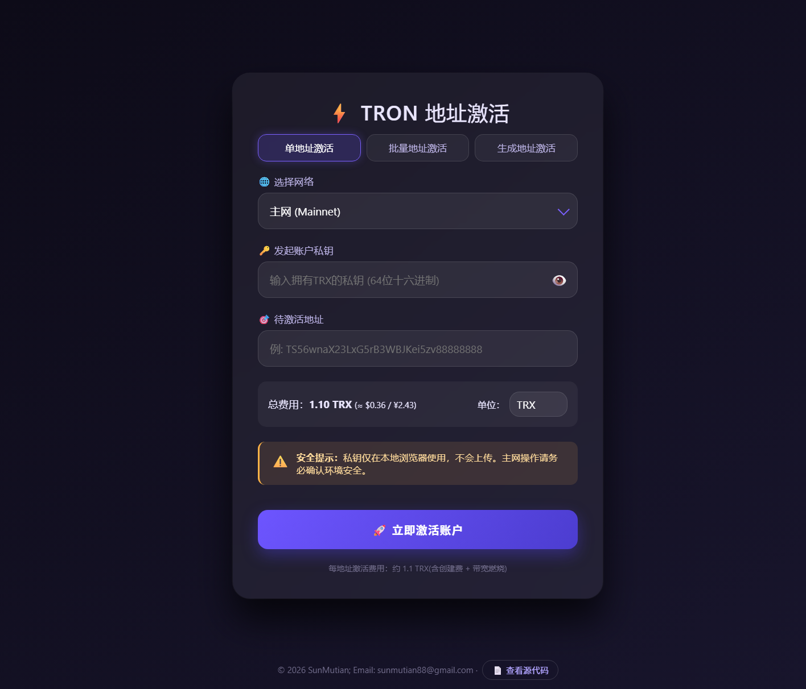

# ⚡ TronActivate

> 版权所有 © 2026-present SunMutian
> Email: sunmutian88@gmail.com

**完全在浏览器端运行的 TRON 账户激活工具，安全、快速、零依赖上传。**

[](https://opensource.org/licenses/MIT)

---



## 🌟 功能亮点

- **三种激活模式**
  
  - 🎯 **单个地址**：手动输入待激活地址
  - 📋 **批量导入**：粘贴多行地址（支持注释 `#` 开头行忽略）
  - 🔹 **生成并激活**：一键随机生成若干私钥/地址并自动激活，激活后导出含私钥的 TXT 文件
- **多网络支持**
  主网 · Nile 测试网 · Shasta 测试网，一键切换
- **实时费用预估**
  自动获取 TRX/USD 汇率和 USD/CNY 汇率，支持 TRX / USD / CNY 作为显示单位，每个地址预估约 1.1 TRX
- **极简安全设计**
  
  - 私钥仅在本地浏览器内存中计算签名，**绝不会发送到任何服务器**
  - 生成模式下的私钥仅临时保存，刷新即消失，导出后请妥善保管
  - 地址/私钥格式、余额充足性在激活前严格校验
- **美化的深色 UI**
  毛玻璃卡片、自定义下拉箭头、进度实时刷新、交易直链区块浏览器

---

> 🔒 **重要提示**：所有计算均在本地进行，建议在无痕窗口或断网状态下操作主网私钥，确保安全。

---

## 📦 项目结构

```txt
TronActivate/
├── index.html # 主页面
├── README.md # 说明文档
├── css/
│ └── style.css # 样式文件
└── lib/
└── TronWeb.js # TronWeb 库（本地离线版）
```

**本地依赖说明**：

- `lib/TronWeb.js` 已集成，无需联网加载 CDN，适合离线或内网使用。
- 如需更新库版本，可替换该文件。

